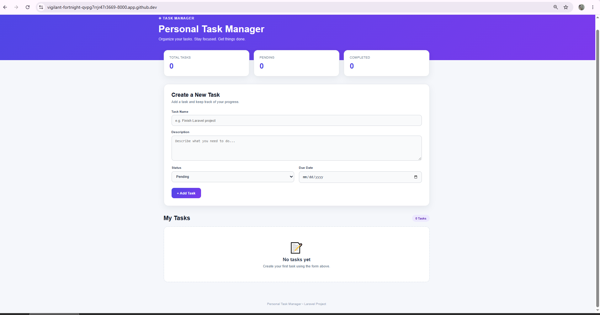
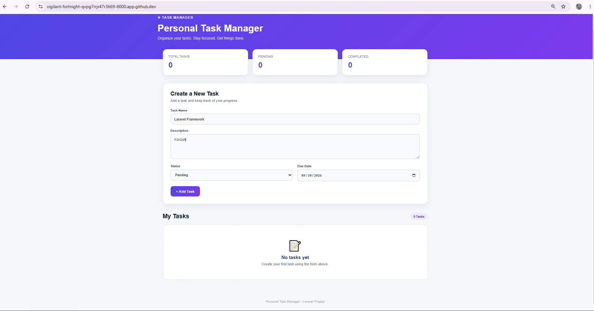
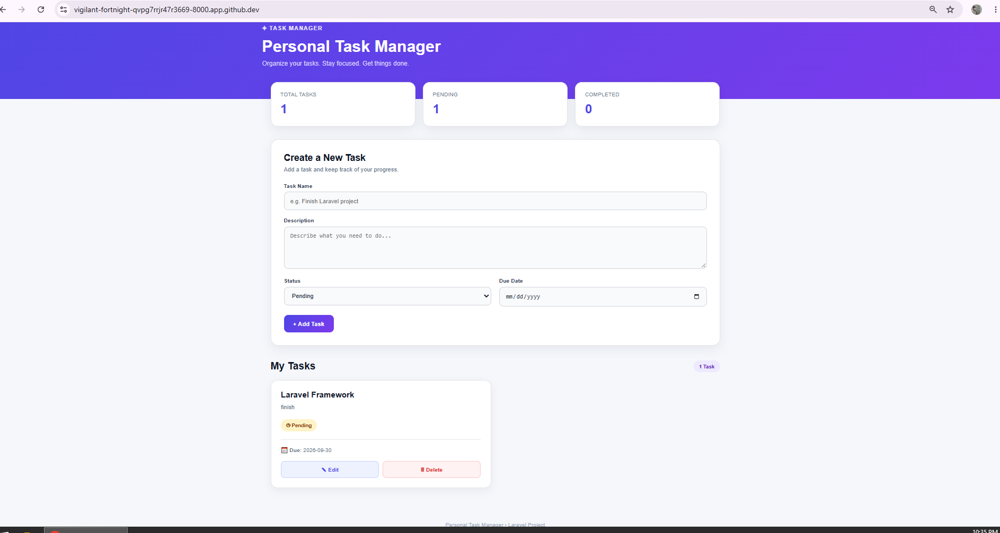
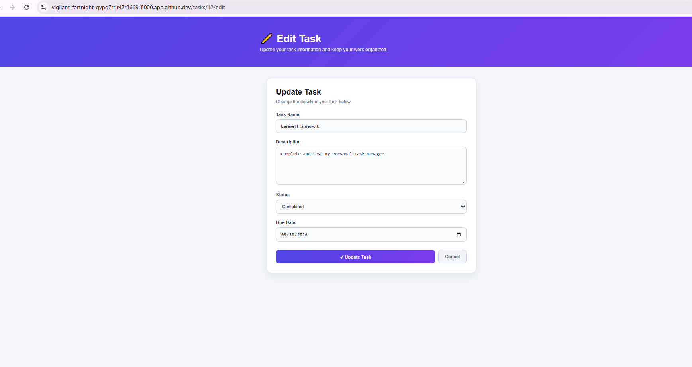
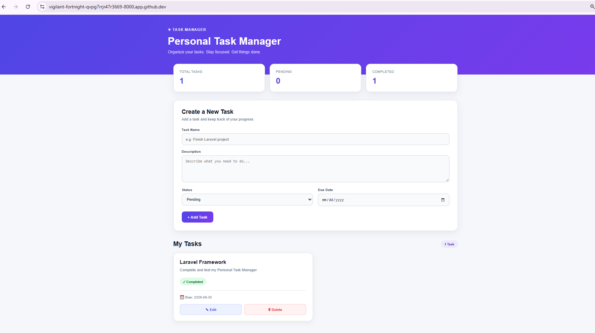
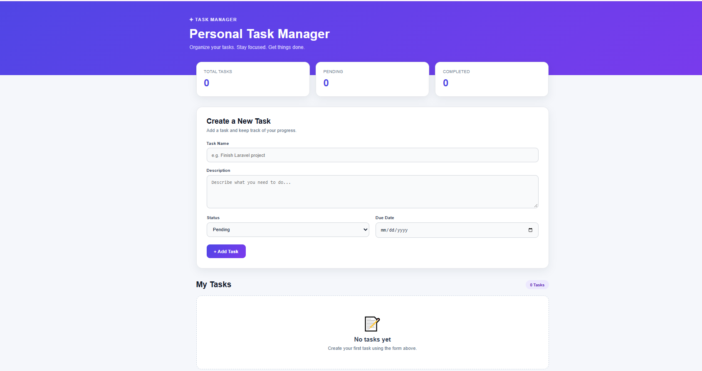

# Personal Task Manager

## Project Information

**Project Code:** WST21-PM-2026-SF

**Student Name:** Jemuel Girado

**Course & Year:** BSIT - 2nd Year

**Database Used:** SQLite

## Features

- Add Task
- View Tasks
- Edit Task
- Delete Task
- Update Status (Pending / Completed)

## Technologies Used

- Laravel
- PHP
- SQLite
- Blade
- HTML
- CSS

## Project Description

Personal Task Manager is a simple Laravel web application that helps users manage their tasks.

Users can:
- Add new tasks
- View saved tasks
- Edit task information
- Delete tasks
- Change the status from Pending to Completed

## CRUD Operations

- **Create** – Add a new task
- **Read** – View all tasks
- **Update** – Edit task information and status
- **Delete** – Remove a task

## How the System Works

### 1. Main Page

The main page displays the Personal Task Manager interface. It contains the task form and the list of saved tasks.

### 2. Add Task

The user fills in the task name, description, status, and due date, then clicks the Add Task button.

### 3. Task Added

After submitting the form, the new task is saved to the database and displayed in the task list.

### 4. Edit Task

The user can click the Edit button to modify the task information or change its status.

### 5. Updated Task

After clicking Update, the changes are saved and the updated task is displayed.

### 6. Delete Task

The user can click the Delete button to remove a task from the task list.

## System Flow

1. Open the Personal Task Manager.
2. Enter the task information.
3. Click Add Task.
4. The task is saved and displayed.
5. Click Edit to modify a task.
6. Update the task information or status.
7. Click Delete to remove a task.

## Output

The system successfully demonstrates the basic CRUD operations:

- Create - Add a new task
- Read - View saved tasks
- Update - Edit task information and status
- Delete - Remove a task
